# OCI DevOps Deploy Strategy

Sample Code for Blue-Green Deployment and Canary Release in OCI DevOps

## BLUE-GREEN Demo Environment

デモ環境概要図

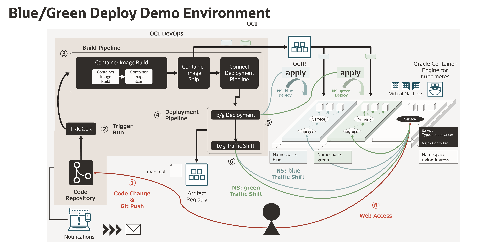

OCI DevOpsにおけるブルー/グリーンデプロイは、最初のデプロイがblue namespace、次のデプロイは、green namespaceとなります。その後は、blue、greenと繰り返される仕組みです。

この仕組みは、OCI DevOpsがIngressのannotations設定を変更することで実現しています。

namespaceA(ここではblue)にデプロイされた時は、namespaceB（ここではgreen）の `canary-weight` が `0` となり、namesapceB（ここではgreen）にデプロイされた場合は、`canary-weight` が `100` となります。

namespaceA(ここではblue)にデプロイ

```
kubectl get ingress -o yaml -n green
```
```
apiVersion: v1
items:
- apiVersion: networking.k8s.io/v1
  kind: Ingress
  metadata:
    annotations:
      kubernetes.io/ingress.class: nginx
      nginx.ingress.kubernetes.io/canary: "true"
      nginx.ingress.kubernetes.io/canary-by-header: redirect-to-namespaceB
      nginx.ingress.kubernetes.io/canary-weight: "0"
・
・＜省略＞
・
```

namesapceB（ここではgreen）にデプロイ

```
kubectl get ingress -o yaml -n green
```
```
apiVersion: v1
items:
- apiVersion: networking.k8s.io/v1
  kind: Ingress
  metadata:
    annotations:
      kubernetes.io/ingress.class: nginx
      nginx.ingress.kubernetes.io/canary: "true"
      nginx.ingress.kubernetes.io/canary-by-header: redirect-to-namespaceB
      nginx.ingress.kubernetes.io/canary-weight: "100"
・
・＜省略＞
・
```
Shift Traffic

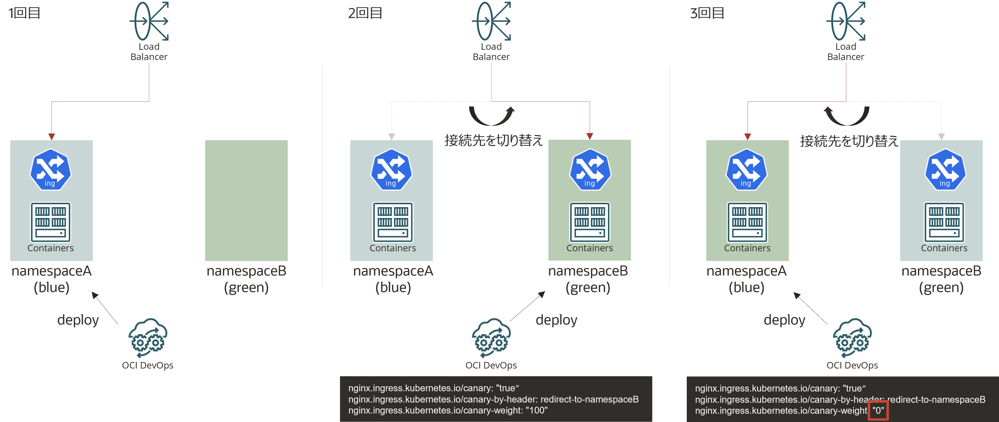

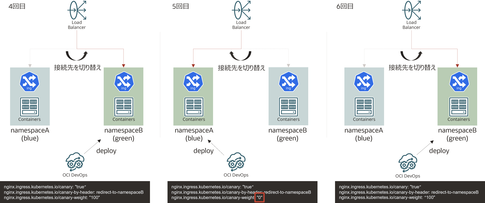

### OKE Setup

以下チュートリアルを参照して、Kubernetesクラスタを構築します。

本でも環境では、3 Node としています。

[Oracle Container Engine for Kubernetes(OKE)をプロビジョニングしよう](https://oracle-japan.github.io/ocitutorials/cloud-native/oke-for-commons/)

1. OKEクラスターのプロビジョニング
2. CLI実行環境(Cloud Shell)の準備

### OCIR Setup

以下チュートリアルを参照して、OCIRにリポジトリを作成します。

[Oracle Cloud Infrastructure(OCI) DevOpsことはじめ-OKE編-](https://oracle-japan.github.io/ocitutorials/cloud-native/devops-for-beginners-oke/)

3. アーティファクト
  - 3-1. OCIRのセットアップ

＜パラメータ＞  
コンパートメント：対象とするコンパートメント  
リポジトリ名：blue-green  
アクセス：パブリック

### Ingress Controller Setup

サンプルコードを取得します。

```
git clone https://github.com/oracle-japan/devops-deploy-strategy.git
```

ディレクトリの内容を確認します。

```
ls devops-deploy-strategy
```
```
deploy-strategy-bg  deploy-strategy-canary  README.md
```

`deploy-strategy-bg` ディレクトリに移動して、ingress controller をセットアップします。

```
cd deploy-strategy-bg
```
```
kubectl apply -f ingress-controller.yaml 
```
```
namespace/ingress-nginx created
serviceaccount/ingress-nginx created
serviceaccount/ingress-nginx-admission created
role.rbac.authorization.k8s.io/ingress-nginx created
role.rbac.authorization.k8s.io/ingress-nginx-admission created
clusterrole.rbac.authorization.k8s.io/ingress-nginx created
clusterrole.rbac.authorization.k8s.io/ingress-nginx-admission created
rolebinding.rbac.authorization.k8s.io/ingress-nginx created
rolebinding.rbac.authorization.k8s.io/ingress-nginx-admission created
clusterrolebinding.rbac.authorization.k8s.io/ingress-nginx created
clusterrolebinding.rbac.authorization.k8s.io/ingress-nginx-admission created
configmap/ingress-nginx-controller created
service/ingress-nginx-controller created
service/ingress-nginx-controller-admission created
deployment.apps/ingress-nginx-controller created
job.batch/ingress-nginx-admission-create created
job.batch/ingress-nginx-admission-patch created
ingressclass.networking.k8s.io/nginx created
validatingwebhookconfiguration.admissionregistration.k8s.io/ingress-nginx-admission created
```

3個の `ingress-nginx-controller` のステータスが `Running` であることを確認します。

```
kubectl get pods -n ingress-nginx
```
```
NAME                                        READY   STATUS      RESTARTS   AGE
ingress-nginx-admission-create-4jptb        0/1     Completed   0          43m
ingress-nginx-admission-patch-5pch2         0/1     Completed   1          43m
ingress-nginx-controller-8574b6d7c9-4nskl   1/1     Running     0          43m
ingress-nginx-controller-8574b6d7c9-6k5zp   1/1     Running     0          43m
ingress-nginx-controller-8574b6d7c9-hpf62   1/1     Running     0          43m
```

LoadBalancer `ingress-nginx-controller` の EXTERNAL-IP が表示されていることを確認します。

```
kubectl get services -n ingress-nginx
```
```
NAME                                 TYPE           CLUSTER-IP      EXTERNAL-IP       PORT(S)                      AGE
ingress-nginx-controller             LoadBalancer   10.96.107.235   132.xxx.xxx.xxx   80:32487/TCP,443:32238/TCP   44m
ingress-nginx-controller-admission   ClusterIP      10.96.101.214   <none>            443/TCP                      44m
```

### Namespace Create

対象のKubernetesクラスタに、BLUEとGREEN用のNamespaceを作成します。

```
kubectl create ns blue
```
```
namespace/blue created
```

```
kubectl create ns green
```
```
namespace/green created
```

blueとgreenのNamespaceができていること確認します。

```
kubectl get ns
```
```
NAME              STATUS   AGE
blue              Active   11m
default           Active   5h58m
green             Active   11m
ingress-nginx     Active   153m
kube-node-lease   Active   5h58m
kube-public       Active   5h58m
kube-system       Active   5h58m
```

### OCI DevOps Setup

#### 1. プロジェクトの作成

OCI DevOps環境の事前準備はこちらを参照して作成します。

[Oracle Cloud Infrastructure(OCI) DevOps事前準備](https://oracle-japan.github.io/ocitutorials/cloud-native/devops-for-commons/)

ここでは、以下の名前で作成します。

トピック名：devops-deploy-strategy
プロジェクト名：blue-green

#### 2. 環境 作成

作成したプロジェクトを選択して、「環境」を選択します。  
左メニューから「環境」を選択します。

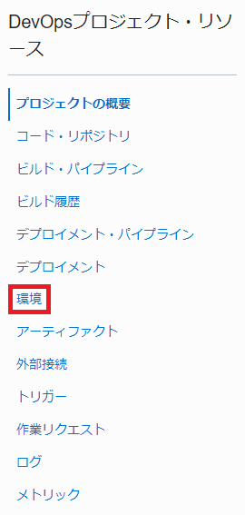

「環境の作成」ボタンをクリックします。


以下の設定を行い、「次」ボタンをクリックします。

- 環境タイプ：Oracle Kubernetesエンジン  
- 名前：blue-green-cluster

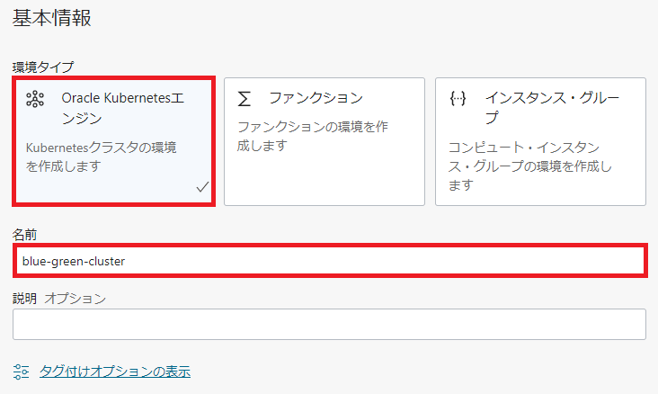


以下の設定を行って、「環境 作成」ボタンをクリックします。

- リージョン：対象クラスタのリージョン  
- コンパートメント：対象のコンパートメント
- クラスタ：対象のクラスタ（ここでは cluster1）

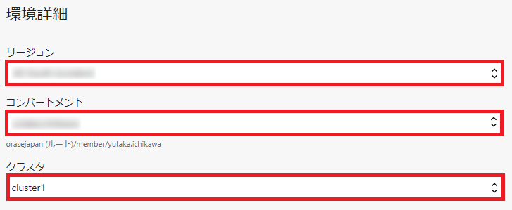


パンくずリストから「blue-green」を選択します。

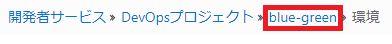

#### 3. コード・リポジトリ 作成

左メニューから「コード・リポジトリ」を選択します。

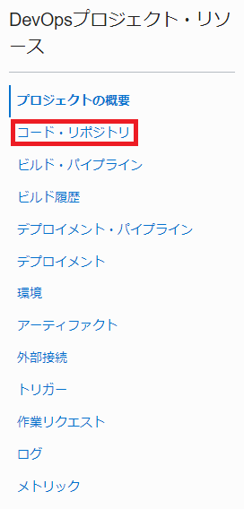

「リポジトリの作成」ボタンをクリックします。


以下の設定を行い、「リポジトリの作成」ボタンをクリックします。

- リポジトリ名：strategy-blue-green  
- デフォルト・ブランチ・オプション：main

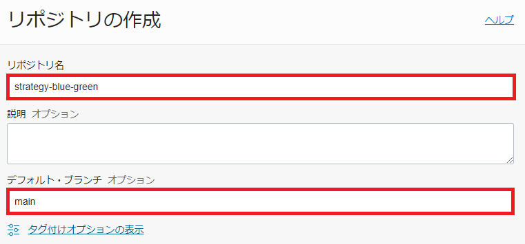


「HTTPS」ボタンをクリックして、コマンドの「コピー」テキストをクリック後、コマンドを実行してクローンします。

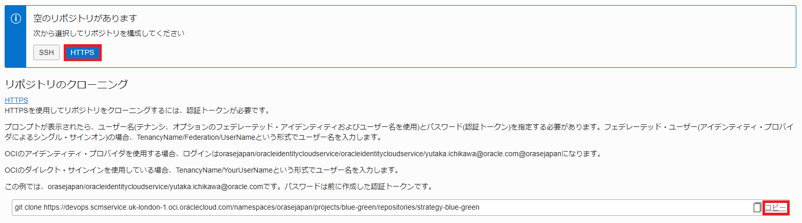

クローンしたディレクトリにサンプルコードをコピーします。

```
cp -pR devops-deploy-strategy/deploy-strategy-bg/* ./strategy-blue-green/
```
```
ls strategy-blue-green/
```
```
blue-green-app.yaml  build_spec.yaml  content.html  Dockerfile  ingress-controller.yaml
```

作成したリポジトリにサンプルコードをプッシュします。

```
cd strategy-blue-green
```
```
git add -A .
```
```
git commit -m "first commit"
```
```
[main 46179ca] first commit
 5 files changed, 785 insertions(+)
 create mode 100644 Dockerfile
 create mode 100644 blue-green-app.yaml
 create mode 100644 build_spec.yaml
 create mode 100644 content.html
 create mode 100644 ingress-controller.yaml
```

```
git branch -M main
```
```
git push -u origin main
```
```
Enumerating objects: 8, done.
Counting objects: 100% (8/8), done.
Delta compression using up to 2 threads
Compressing objects: 100% (7/7), done.
Writing objects: 100% (7/7), 3.79 KiB | 1.26 MiB/s, done.
Total 7 (delta 0), reused 0 (delta 0), pack-reused 0
To https://devops.scmservice.uk-london-1.oci.oraclecloud.com/namespaces/orasejapan/projects/blue-green/repositories/strategy-blue-green
   dc00f99..46179ca  main -> main
Branch 'main' set up to track remote branch 'main' from 'origin'.
```

リポジトリを確認すると、サンプルコードが表示されています。

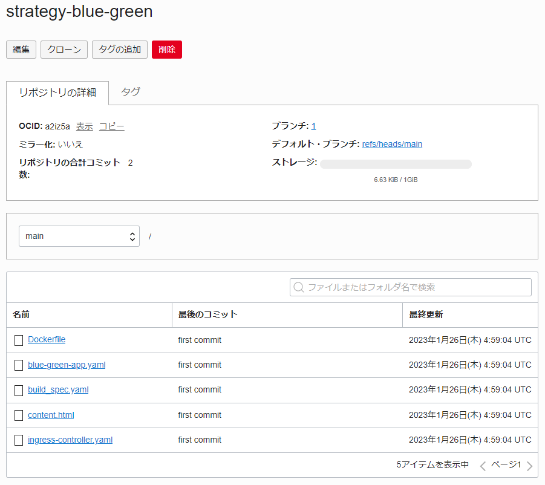

#### 4. アーティファクト 作成

Kubernetesクラスタにデプロイする際に必要となるマニフェストファイルをアーティファクトレジストリにアップロードします。最初にアーティファクトレジストリにリポジトリを作成します。

アップロードするマニフェストファイル内にある、コンテナイメージのパスを変更します。

```
cd strategy-blue-green
```
```
vim blue-green-app.yaml 
```
```
apiVersion: apps/v1
kind: Deployment
metadata:
  name: helloworld
spec:
  selector:
    matchLabels:
      app: helloworld
  replicas: 3
  template:
    metadata:
      labels:
        app: helloworld
    spec:
      containers:
        - name: helloworld
          # enter the path to your image, be sure to include the correct region prefix
          image: <your-region>.ocir.io/<your-object-storage-namespace>/blue-green/blue-green-app:${BUILDRUN_HASH} #対象となるパスに変更
          ports:
            - containerPort: 80
---
apiVersion: v1
kind: Service
metadata:
  name: helloworld
spec:
  type: ClusterIP
  ports:
    - port: 80
      targetPort: 80
  selector:
    app: helloworld
---
# main-ingress.yaml with networking.k8s.io/v1 version
apiVersion: networking.k8s.io/v1
kind: Ingress
metadata:
  name: helloworld-ing
  annotations:
    kubernetes.io/ingress.class: "nginx"
spec:
  rules: 
    - http:
        paths:
          - path: /
            pathType: Prefix
            backend:
              service:
                name: helloworld
                port:
                  number: 80
```

ハンバーガーメニューから「開発者サービス」-「アーティファクト・レジストリ」を選択します。

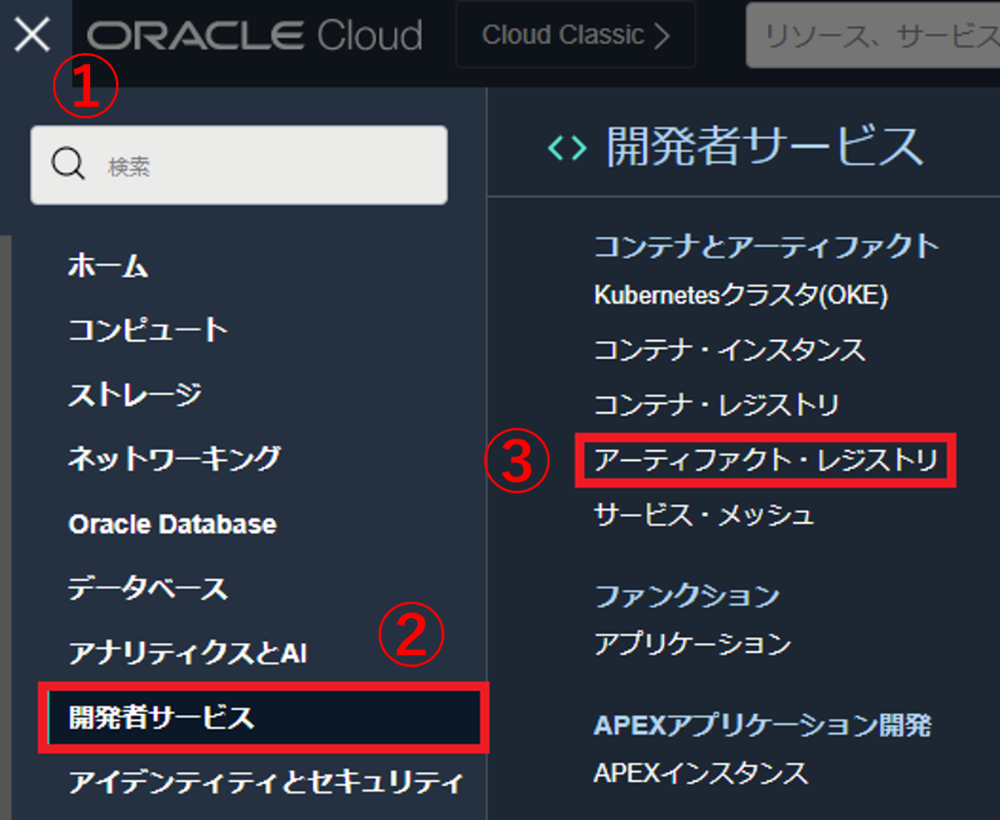

「リポジトリの作成」ボタンをクリックします。


以下の設定を行い、「作成」ボタンをクリックします。

- 名前：artifact-repository-bg
- コンパートメント：対象となるコンパートメント
- 不変アーティファクト：チェックを外す

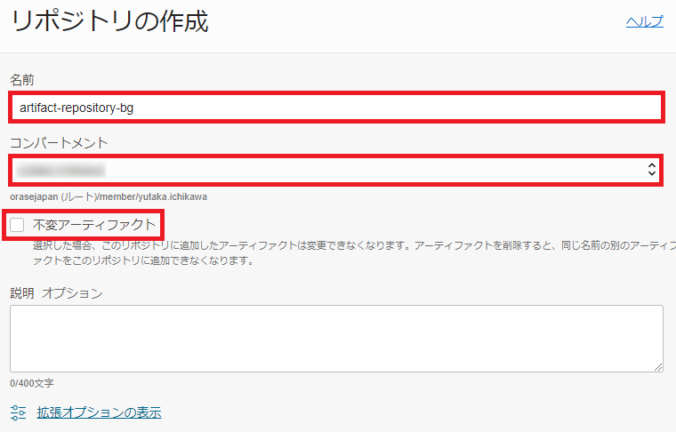


マニフェストファイルをアップロードします。「アーティファクトのアップロード」ボタンをクリックします。


以下の設定を行い、「コピー」テキストをクリックします。

- アーティファクト・パス：blue-green-app.yaml
- バージョン：1
- Uplad method：Cloud Shell

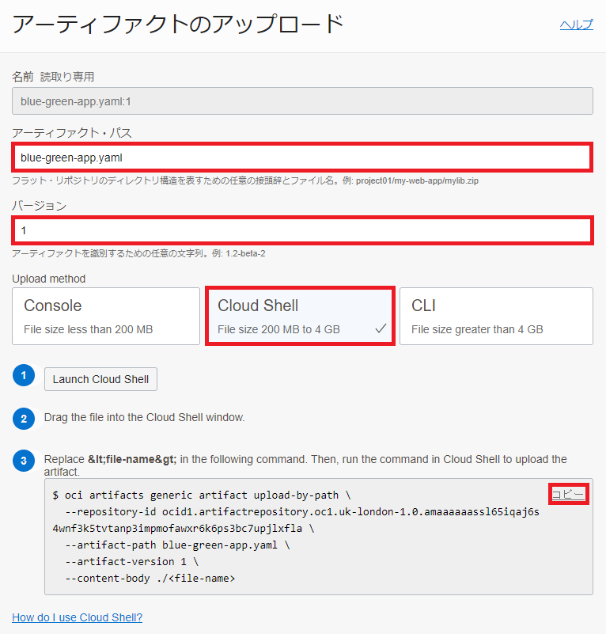

コピーした内容をペーストして、「./＜file-name＞」の箇所を「./blue-grenn-app.yaml」に変更してコマンドを実行します。

```
oci artifacts generic artifact upload-by-path \
>   --repository-id ocid1.artifactrepository.oc1.uk-london-1.0.amaaaaaassl65iqaj6s4wnf3k5tvtanp3impmofawxr6k6ps3bc7upjlxfla \
>   --artifact-path blue-green-app.yaml \
>   --artifact-version 1 \
>   --content-body ./blue-green-app.yaml
```
以下の結果が返ってくればアップロード完了です。
```
{
  "data": {
    "artifact-path": "blue-green-app.yaml",
    "compartment-id": "ocid1.compartment.oc1..aaaaaaaagp3t6j5zjzg3hrau4i3rtcxvl64cxbcdgpid5smp6avpnfecegqa",
    "defined-tags": {},
    "display-name": "blue-green-app.yaml:1",
    "freeform-tags": {},
    "id": "ocid1.genericartifact.oc1.uk-london-1.0.amaaaaaassl65iqakquhxcpokv7k3sfdq53hx2dxyzhtnd6vaxgrkilrzxeq",
    "lifecycle-state": "AVAILABLE",
    "repository-id": "ocid1.artifactrepository.oc1.uk-london-1.0.amaaaaaassl65iqaj6s4wnf3k5tvtanp3impmofawxr6k6ps3bc7upjlxfla",
    "sha256": "de9f5af3b99b54c0aa05a473af504644972f9cb1a0ed0c283214e4debd7a930d",
    "size-in-bytes": 1167,
    "time-created": "2023-01-26T05:32:22.234000+00:00",
    "version": "1"
  }
}
```

「閉じる」ボタンをクリックします。

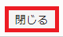

ブラウザを更新するとアップロードしたアーティファクトがリストされます。

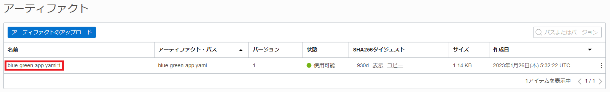

OCI DevOpsの「blue-green」プロジェクト画面に戻って、アーティファクトに対象のOCIRとアーティファクトレジストリのリポジトリを登録します。

OCI DevOpsの左目メニューから「アーティファクト」を選択します。

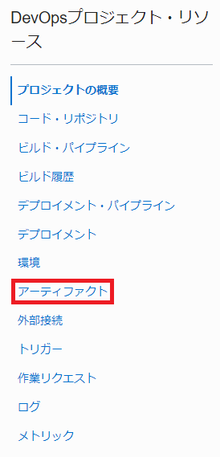

「アーティファクトの追加」ボタンをクリックします。


以下の設定を行い、「追加」ボタンをクリックします。

- 名前：ocir-repogitory-bg
- タイプ：コンテナ・イメージ・リポジトリ
- コンテナ・レジストリのイメージへの完全修飾パスを入力してください：マニフェストファイルに指定したリポジトリを設定してください

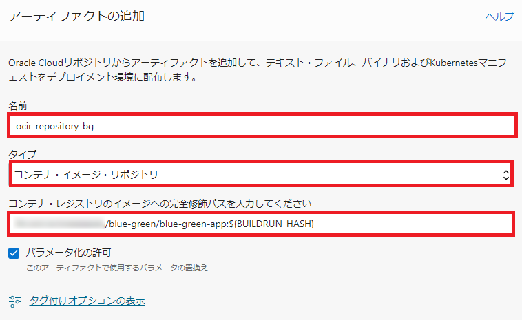


「アーティファクトの追加」ボタンをクリックします。


以下の設定を行い、「選択」ボタンをクリックします。

- 名前：artifact-repogitory-bg
- タイプ：Kubernetesマニフェスト

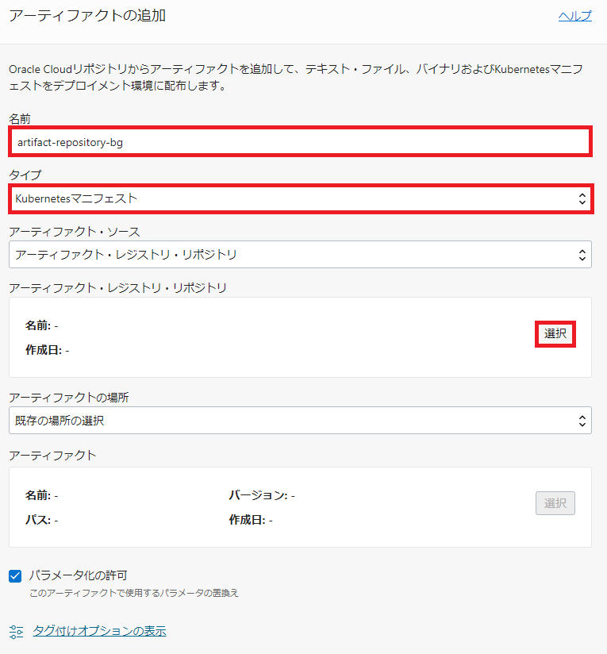

以下の設定を行い、「選択」ボタンをクリックします。

- リージョン：対象となるリージョン
- コンパートメント：対象となるコンパートメント
- アーティファクト・レジストリ・リポジトリ：artifact-repository-bg

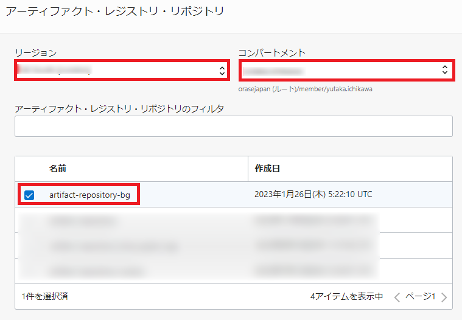


「アーティファクト」の「選択」ボタンをクリックします。

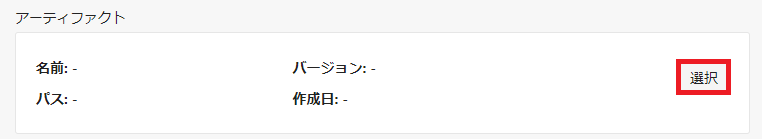

「blue-green-app.yaml:v1」にチェックを入れて、「選択」ボタンをクリックします。

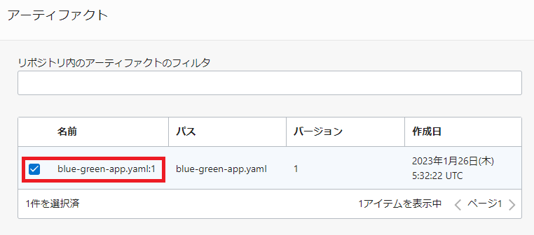


最後に「追加」ボタンをクリックします。


登録したOCIRとアーティファクト・レジストリのリポジトリがリストされていることを確認します。

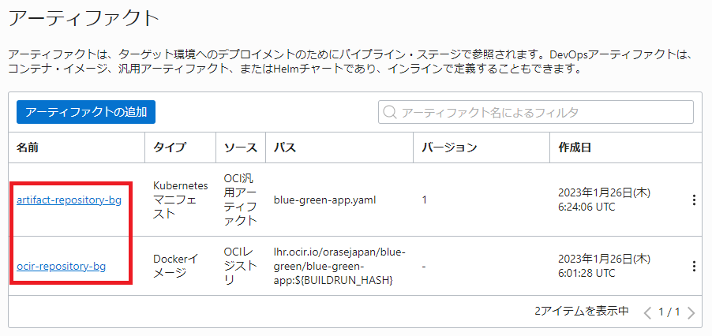

パンくずリストから「blue-green」を選択します。

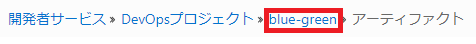

#### 5. デプロイメント・パイプライン 作成

デプロイメント・パイプラインを作成します。  
左メニューから「デプロイメント・パイプライン」を選択します。

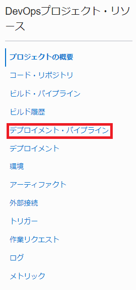

「パイプラインの作成」ボタンをクリックします。


以下の設定を行い、「パイプラインの作成」ボタンをクリックします。

- パイプライン名：deploy-to-oke

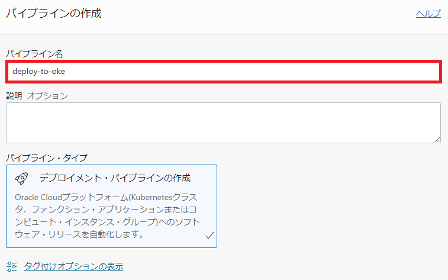


「ステージの追加」ボタンをクリックします。

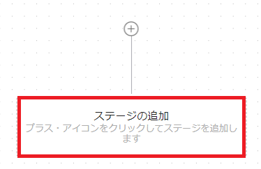

「ブルー/グリーン戦略」を選択して、「次」ボタンをクリックします。

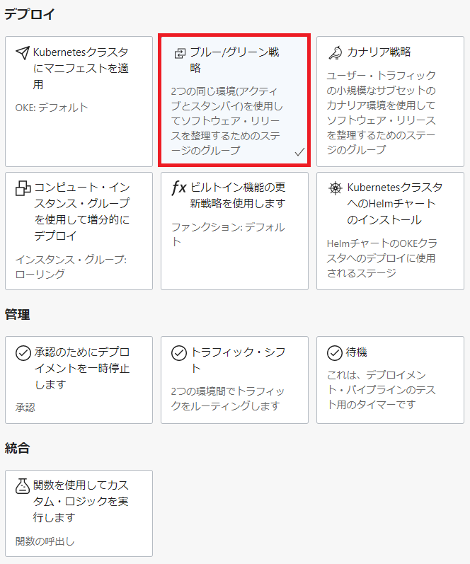


以下の設定を行い、「アーティファクトの選択」ボタンをクリックします。

- デプロイメント・タイプ：OKE
- ステージ名：deploy-strategy-bg
- 環境：blue-green-cluster
- ネームスペースA：blue
- ネームスペースB：green
- NGINXイングレス名：helloworld-ing

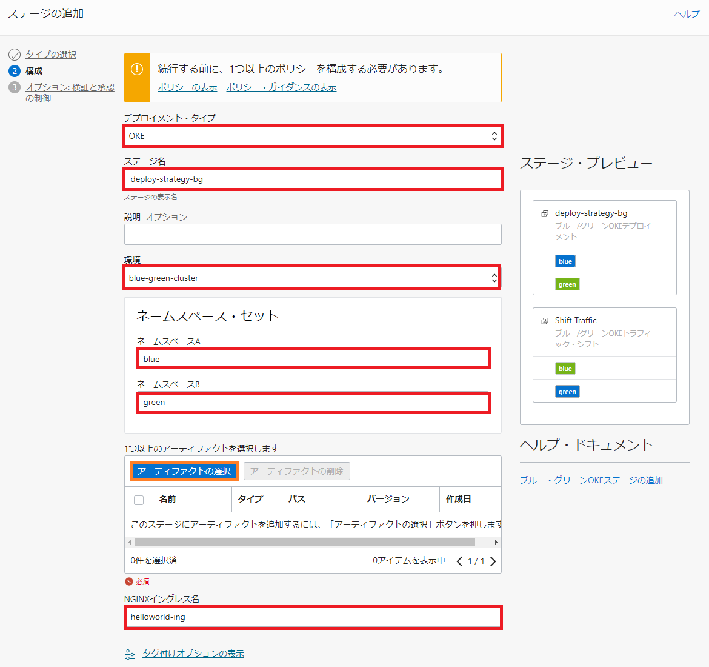

「artifact-repository-bg」を選択して、「変更の保存」ボタンをクリックします。

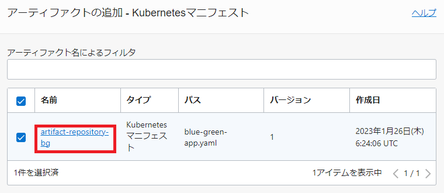


「次」ボタンをクリックします。


以下の設定を行い、「追加」ボタンをクリックします。

- 承認制御：有効
- ステージ名：confirm

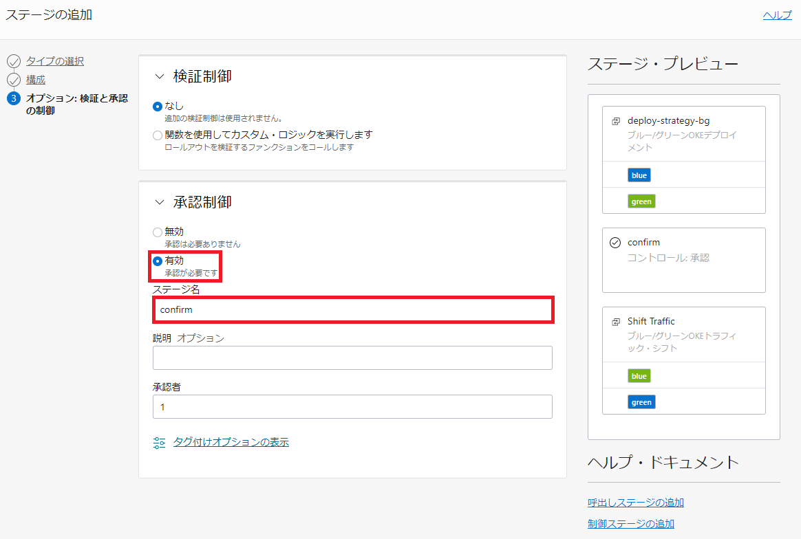


完了と表示されることを確認して、「閉じる」ボタンをクリックします。

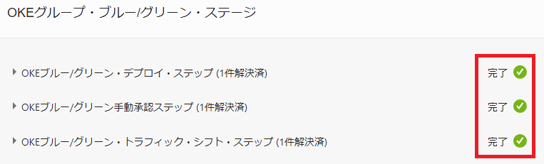


パンくずリストから「blue-green」を選択します。

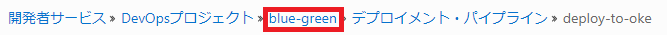

#### 6. ビルド・パイプライン 作成

ビルド・パイプラインを作成します。  
左メニューから「ビルド・パイプライン」を選択します。

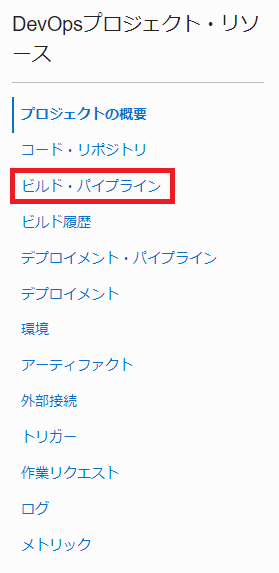

「ビルド・パイプラインの作成」ボタンをクリックします。


以下の設定を行い、「作成」ボタンをクリックします。

- 名前：image-build-ship

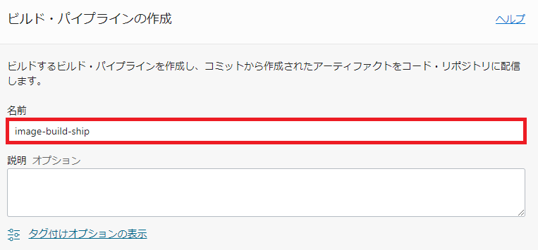


「ステージの追加」ボタンをクリックします。


「マネージド・ビルド」を選択して、「次」ボタンをクリックします。

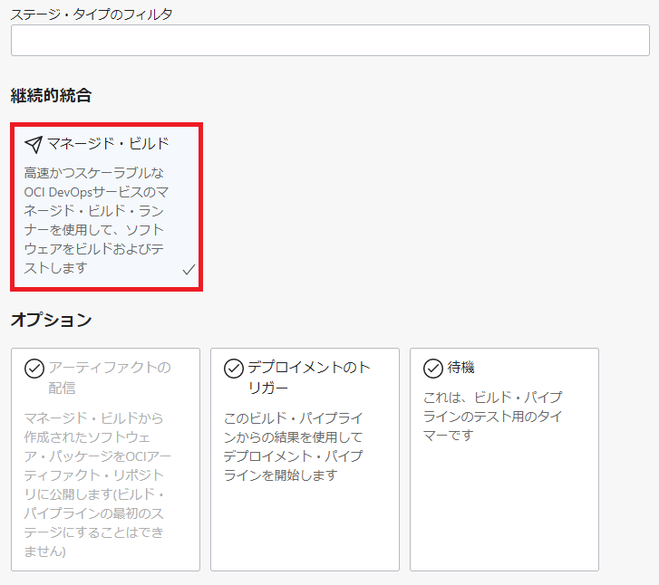


以下の設定を行い、「選択」ボタンをクリックします。

- ステージ名：container-image-build
- ビルド仕様ファイル・パス：build_spec.yaml

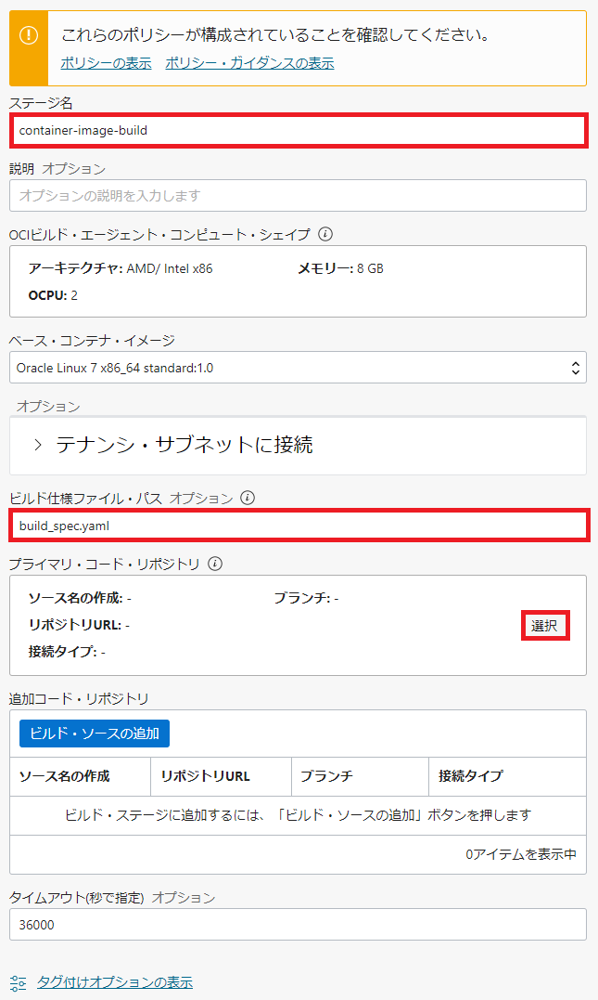

以下の設定を行い、「選択」ボタンをクリックします。

- ソース：接続タイプ：OCIコード・リポジトリ
- strategy-blue-grenn にチェックを入れる
- ブランチの選択：main

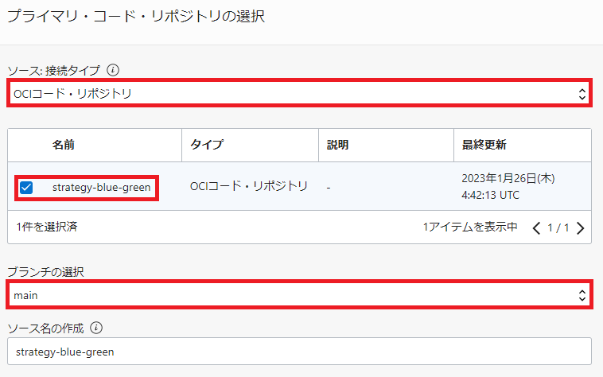


「追加」ボタンをクリックします。


「+」をクリックして、「ステージの追加」を選択します。

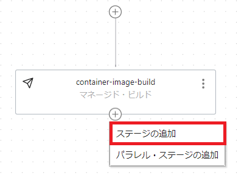

「アーティファクトの配信」を選択して、「次」ボタンをクリックします。

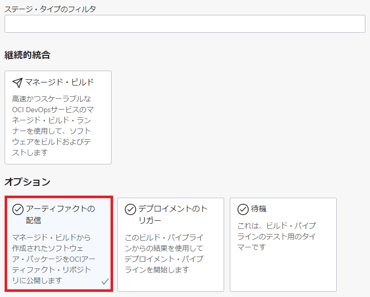


以下の設定を行い、「アーティファクトの選択」ボタンをクリックします。

- ステージ名：container-image-ship

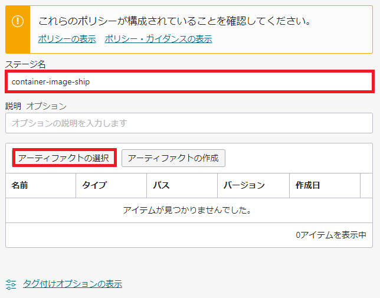

「ocir-repository-bg」にチェックを入れて、「追加」ボタンをクリックします。

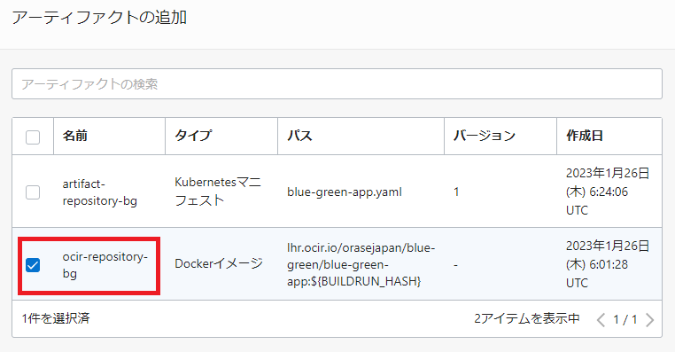

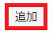

「ビルド構成/結果アーティファクト名」に「bg_image」と設定を行い、「追加」ボタンをクリックします。

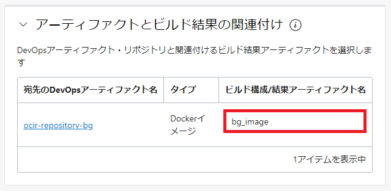


「+」をクリックして、「ステージの追加」を選択します。

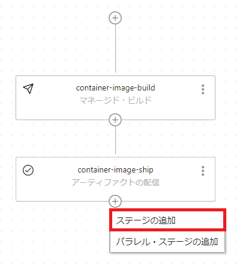

「デプロイメントのトリガー」を選択して、「次」ボタンをクリックします。

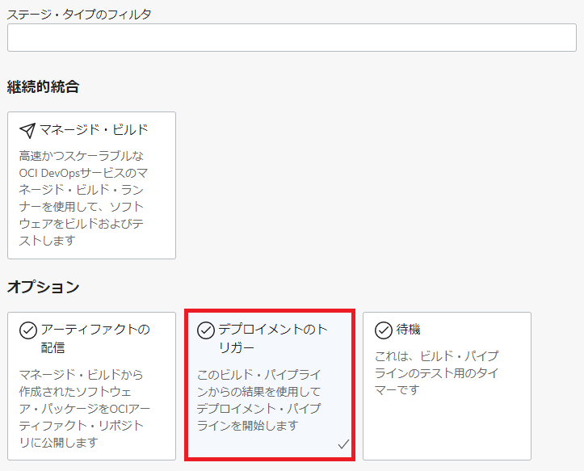


以下の設定を行い、「デプロイメント・パイプラインの選択」ボタンをクリックします。

- ステージ名：connect-to-deployment-pipeline

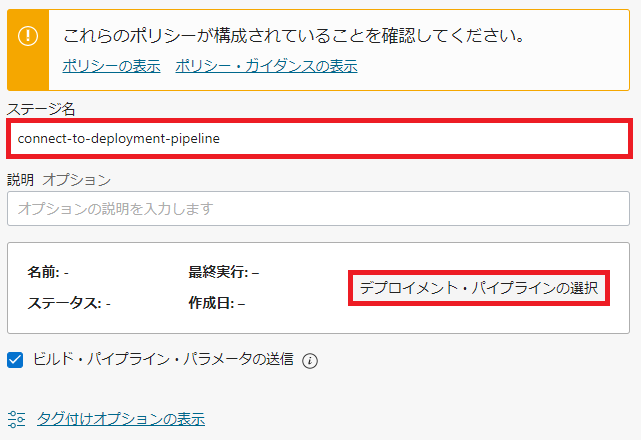

「deploy-to-oke」にチェックを入れて、「変更の保存」ボタンをクリックします。

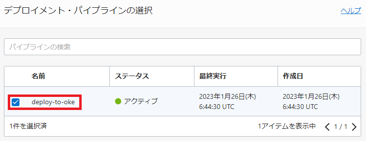


最後に「追加」ボタンをクリックします。


パンくずリストから「blue-green」を選択します。


#### 7. トリガー 作成

ソースコード更新後のプッシュをトリガーにBlue-Greenデプロイを実行する設定を行います。  
左メニューから「トリガー」を選択します。

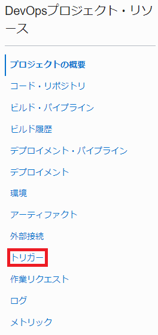

「トリガーの作成」ボタンをクリックします。


以下の設定を行い、「選択」ボタンをクリックします。

- 名前：deploy-strategy-bg
- ソース接続：OCIコード・リポジトリ

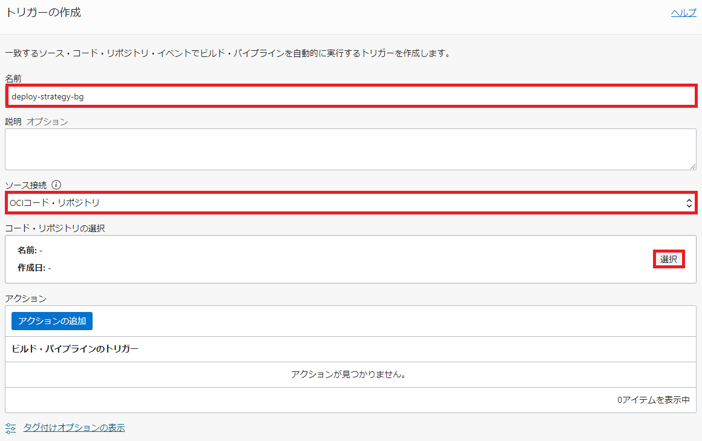

「strategy-blue-grenn」にチェックを入れて、「変更の保存」ボタンをクリックします。

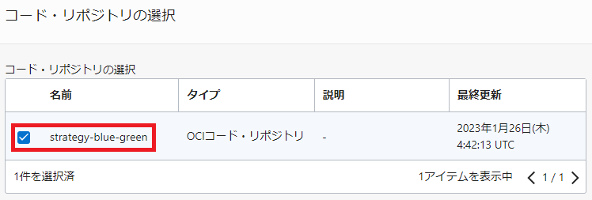


「アクションの追加」ボタンをクリックします。

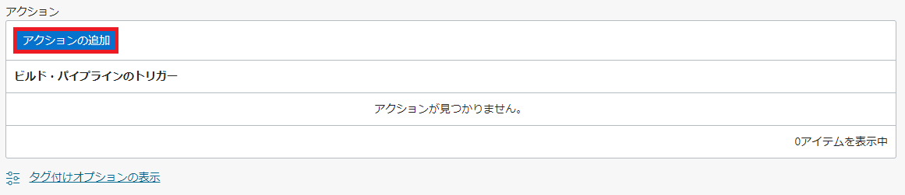

「プッシュ」にチェックを入れて、「選択」ボタンをクリックします。

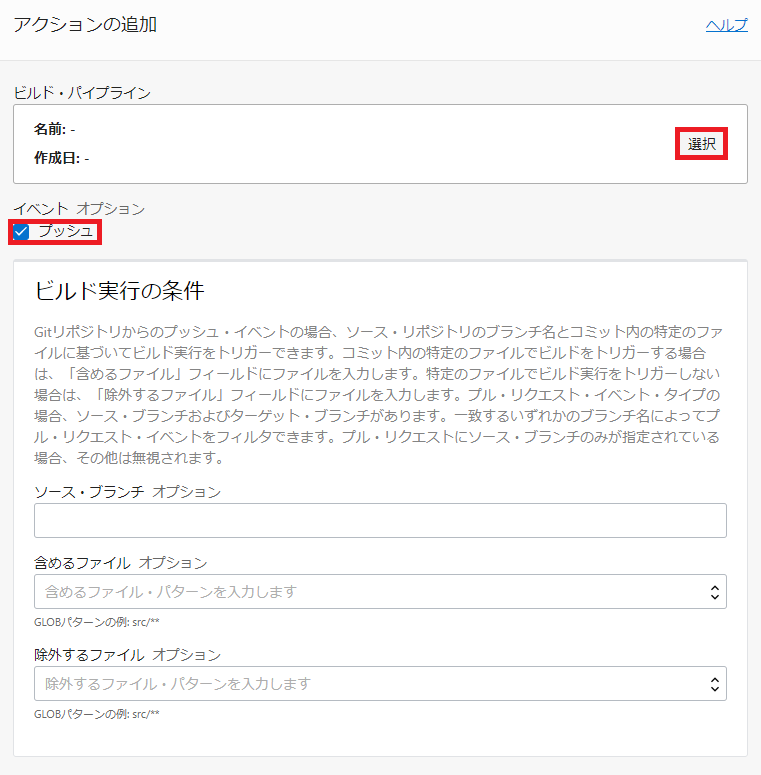

「image-build-ship」にチェックを入れて、「選択」ボタンをクリックします。

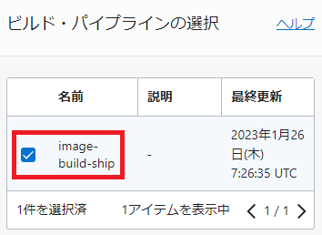


「アクションの追加」ボタンをクリックします。


最後に、「作成」ボタンをクリックします。


以上で完了です。

### ブルー/グリーンデプロイ 実行

実際にブルー/グリーンデプロイを実行するために、ソースコードを変更します。

```
cd strategy-blue-green
```

表示されるテキストの「Hello, Blue deploy !!」を「Hello, Blue deploy first!!」に変更します。

```
vim content.html
```
```
<!DOCTYPE html>
<html lang="ja">
<head>

<meta charset="UTF-8">

<title>Blue-Green</title>

</head>
<body>

<h1>Hello, Blue deploy !!</h1> #「Blue deploy first!!」に変更

</body>
</html>
```

コード・リポジトリにプッシュします。

```
git add -A .
```
```
git commit -m "first commit"
```
```
[main 03ffea8] first commit
 5 files changed, 785 insertions(+)
 create mode 100644 Dockerfile
 create mode 100644 blue-green-app.yaml
 create mode 100644 build_spec.yaml
 create mode 100644 content.html
 create mode 100644 ingress-controller.yaml
```
```
git branch -M main
```
```
git push -u origin main
```
```
Enumerating objects: 8, done.
Counting objects: 100% (8/8), done.
Delta compression using up to 2 threads
Compressing objects: 100% (7/7), done.
Writing objects: 100% (7/7), 3.79 KiB | 1.89 MiB/s, done.
Total 7 (delta 0), reused 0 (delta 0), pack-reused 0
To https://devops.scmservice.uk-london-1.oci.oraclecloud.com/namespaces/orasejapan/projects/blue-green/repositories/strategy-blue-green
   aca6740..03ffea8  main -> main
Branch 'main' set up to track remote branch 'main' from 'origin'.
```

プッシュ処理をトリガーにビルド・パイプラインが実行されます。  
ビルド・パイプラインの成功後、デプロイメント・パイプラインが実行されます。

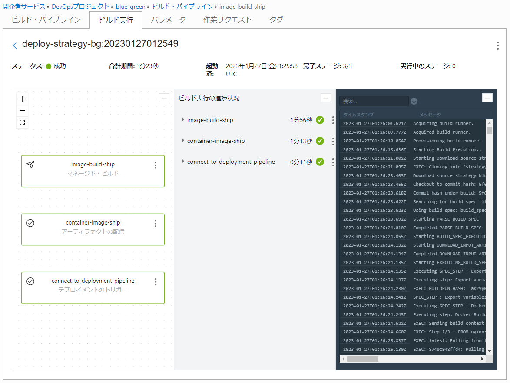

デプロイメント・パイプラインでは、承認処理をする必要があります。  
ハンバーガーメニューをクリックして、「承認」を選択します。

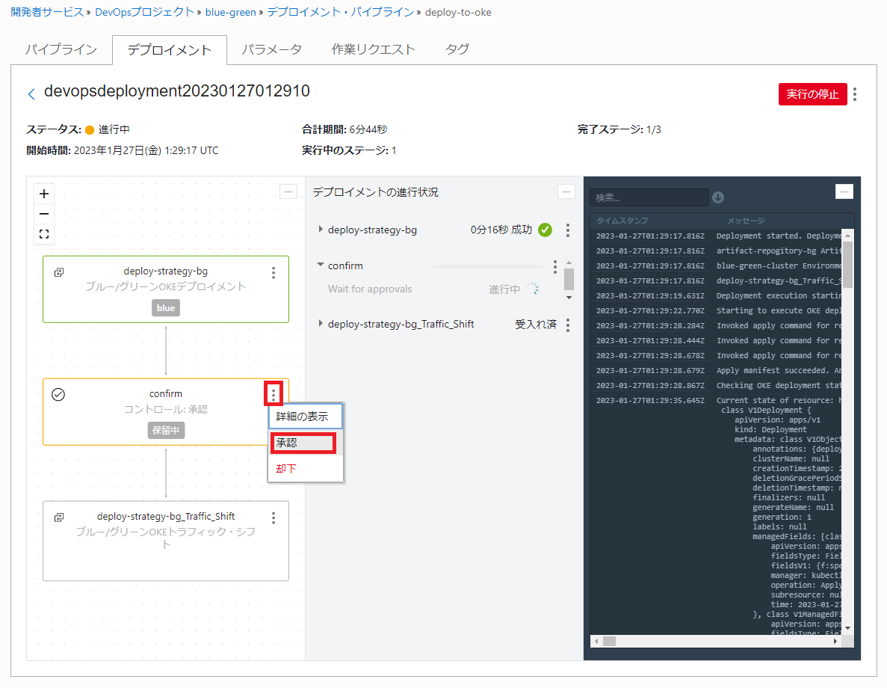

「OK」と入力して、「承認」ボタンをクリックします。

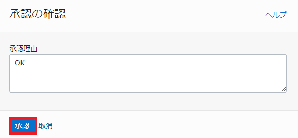

デプロイメント・パイプラインが成功したことを確認します。

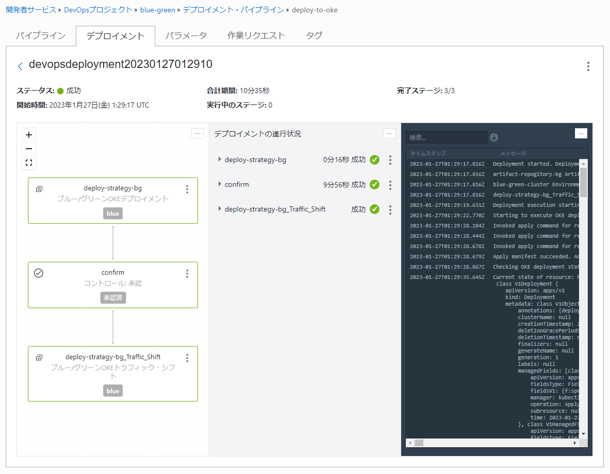

Kubernetesクラスタのblue namespaceにデプロイされていることを確認します。

```
kubectl get pods -n blue
```
```
NAME                          READY   STATUS    RESTARTS   AGE
helloworld-5d66bf56f4-b69sz   1/1     Running   0          13m
helloworld-5d66bf56f4-hvvnk   1/1     Running   0          13m
helloworld-5d66bf56f4-pdfbb   1/1     Running   0          13m
```

Ingressに割り当てられたEXTERNAL-IPを確認します。

```
kubectl get ingress -n blue
```
```
NAME             CLASS    HOSTS   ADDRESS           PORTS   AGE
helloworld-ing   <none>   *       132.xxx.xxx.xxx   80      14m
```

ブラウザからアクセスします。

```
http://132.xxx.xxx.xxx/content.html
```

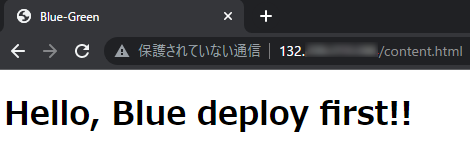

再度デプロイを実行して、green namespaceにデプロイされることを確認します。  
ソースコードを変更します。

```
vim content.html
```
```
<!DOCTYPE html>
<html lang="ja">
<head>

<meta charset="UTF-8">

<title>Blue-Green</title>

</head>
<body>

<h1>Hello, Green deploy first!!</h1> #「Green deploy first!!」に変更

</body>
</html>
```

コード・リポジトリにプッシュします。

```
git add -A .
```
```
git commit -m "second commit"
```
```
[main db77643] second commit
 1 file changed, 1 insertion(+), 1 deletion(-)
```
```
git branch -M main
```
```
git push -u origin main
```
```
Enumerating objects: 5, done.
Counting objects: 100% (5/5), done.
Delta compression using up to 2 threads
Compressing objects: 100% (3/3), done.
Writing objects: 100% (3/3), 292 bytes | 292.00 KiB/s, done.
Total 3 (delta 2), reused 0 (delta 0), pack-reused 0
remote: Resolving deltas: 100% (2/2)
To https://devops.scmservice.uk-london-1.oci.oraclecloud.com/namespaces/orasejapan/projects/blue-green/repositories/strategy-blue-green
   5f6b809..db77643  main -> main
Branch 'main' set up to track remote branch 'main' from 'origin'.
```

このプッシュ処理をトリガーに、ビルド・パイプライン、デプロイメント・パイプラインが実行されて、デプロイされます。デプロイメント・パイプラインでは一回目と同様に承認処理を手動で実行します。

```
kubectl get pods -n green
```
```
NAME                          READY   STATUS    RESTARTS   AGE
helloworld-7cd5f9b688-g4sln   1/1     Running   0          5m24s
helloworld-7cd5f9b688-mphp7   1/1     Running   0          5m24s
helloworld-7cd5f9b688-xwfhv   1/1     Running   0          5m24s
```

Ingressに割り当てられたEXTERNAL-IPを確認します。  
※ngress Controllerによりblue namespaceと同じEXTERNAL-IPとなります。

```
kubectl get ingress -n green
```
```
NAME             CLASS    HOSTS   ADDRESS           PORTS   AGE
helloworld-ing   <none>   *       132.xxx.xxx.xxx   80      14m
```

ブラウザからアクセスします。

```
http://132.xxx.xxx.xxx/content.html
```

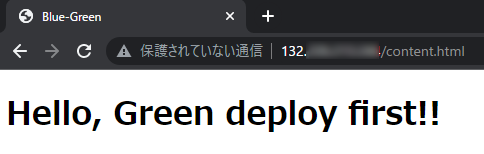

以上で完了です。

## CANARY Demo Environment

デモ環境概要図

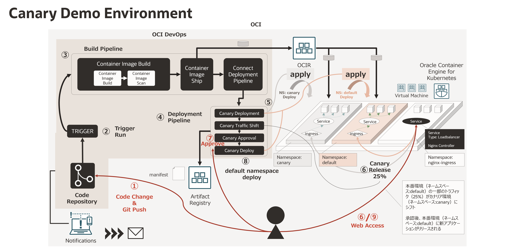

### OKE

以下チュートリアルを参照して、Kubernetesクラスタを構築します。

本でも環境では、3 Node としています。

[Oracle Container Engine for Kubernetes(OKE)をプロビジョニングしよう](https://oracle-japan.github.io/ocitutorials/cloud-native/oke-for-commons/)

1. OKEクラスターのプロビジョニング
2. CLI実行環境(Cloud Shell)の準備

### OCIR

以下チュートリアルを参照して、OCIRにリポジトリを作成します。

[Oracle Cloud Infrastructure(OCI) DevOpsことはじめ-OKE編-](https://oracle-japan.github.io/ocitutorials/cloud-native/devops-for-beginners-oke/)

3. アーティファクト
  - 3-1. OCIRのセットアップ

＜パラメータ＞  
コンパートメント：対象とするコンパートメント  
リポジトリ名：canary  
アクセス：パブリック

### Ingress Controller Setup

サンプルコードを取得します。

```
git clone https://github.com/oracle-japan/devops-deploy-strategy.git
```

ディレクトリの内容を確認します。

```
ls devops-deploy-strategy
```
```
deploy-strategy-bg  deploy-strategy-canary  README.md
```

`deploy-strategy-canary` ディレクトリに移動して、ingress controller をセットアップします。

```
cd deploy-strategy-canary
```
```
kubectl apply -f ingress-controller.yaml 
```
```
namespace/ingress-nginx created
serviceaccount/ingress-nginx created
serviceaccount/ingress-nginx-admission created
role.rbac.authorization.k8s.io/ingress-nginx created
role.rbac.authorization.k8s.io/ingress-nginx-admission created
clusterrole.rbac.authorization.k8s.io/ingress-nginx created
clusterrole.rbac.authorization.k8s.io/ingress-nginx-admission created
rolebinding.rbac.authorization.k8s.io/ingress-nginx created
rolebinding.rbac.authorization.k8s.io/ingress-nginx-admission created
clusterrolebinding.rbac.authorization.k8s.io/ingress-nginx created
clusterrolebinding.rbac.authorization.k8s.io/ingress-nginx-admission created
configmap/ingress-nginx-controller created
service/ingress-nginx-controller created
service/ingress-nginx-controller-admission created
deployment.apps/ingress-nginx-controller created
job.batch/ingress-nginx-admission-create created
job.batch/ingress-nginx-admission-patch created
ingressclass.networking.k8s.io/nginx created
validatingwebhookconfiguration.admissionregistration.k8s.io/ingress-nginx-admission created
```

3個の `ingress-nginx-controller` のステータスが `Running` であることを確認します。

```
kubectl get pods -n ingress-nginx
```
```
NAME                                        READY   STATUS      RESTARTS   AGE
ingress-nginx-admission-create-4jptb        0/1     Completed   0          43m
ingress-nginx-admission-patch-5pch2         0/1     Completed   1          43m
ingress-nginx-controller-8574b6d7c9-4nskl   1/1     Running     0          43m
ingress-nginx-controller-8574b6d7c9-6k5zp   1/1     Running     0          43m
ingress-nginx-controller-8574b6d7c9-hpf62   1/1     Running     0          43m
```

LoadBalancer `ingress-nginx-controller` の EXTERNAL-IP が表示されていることを確認します。

```
kubectl get services -n ingress-nginx
```
```
NAME                                 TYPE           CLUSTER-IP      EXTERNAL-IP       PORT(S)                      AGE
ingress-nginx-controller             LoadBalancer   10.96.107.235   132.xxx.xxx.xxx   80:32487/TCP,443:32238/TCP   44m
ingress-nginx-controller-admission   ClusterIP      10.96.101.214   <none>            443/TCP                      44m
```

### Namespace Create

対象のKubernetesクラスタに、CANARY用のNamespaceを作成します。

```
kubectl create ns canary
```
```
namespace/canary created
```

canaryのNamespaceができていること確認します。

```
kubectl get ns
```
```
NAME              STATUS   AGE
blue              Active   11m
canary            Active   10s
default           Active   5h58m
green             Active   11m
ingress-nginx     Active   153m
kube-node-lease   Active   5h58m
kube-public       Active   5h58m
kube-system       Active   5h58m
```

### OCI DevOps Setup

#### 1. プロジェクトの作成

OCI DevOps環境の事前準備はこちらを参照して作成します。

[Oracle Cloud Infrastructure(OCI) DevOps事前準備](https://oracle-japan.github.io/ocitutorials/cloud-native/devops-for-commons/)

ここでは、以下の名前で作成します。

トピック名：devops-deploy-strategy
プロジェクト名：canary

#### 2. 環境 作成

作成したプロジェクトを選択して、「環境」を選択します。  
左メニューから「環境」を選択します。


「環境の作成」ボタンをクリックします。


以下の設定を行い、「次」ボタンをクリックします。

- 環境タイプ：Oracle Kubernetesエンジン  
- 名前：canary-cluster

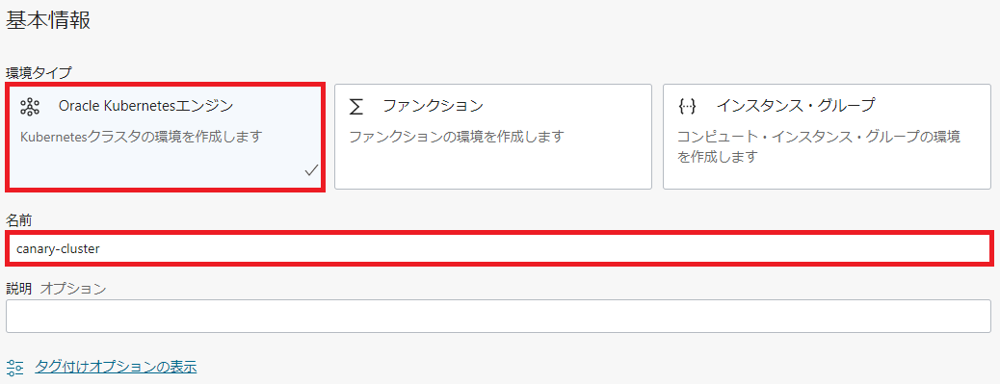


以下の設定を行って、「環境 作成」ボタンをクリックします。

- リージョン：対象クラスタのリージョン  
- コンパートメント：対象のコンパートメント
- クラスタ：対象のクラスタ（ここでは cluster1）


パンくずリストから「canary」を選択します。


#### 3. コード・リポジトリ 作成

左メニューから「コード・リポジトリ」を選択します。


「リポジトリの作成」ボタンをクリックします。


以下の設定を行い、「リポジトリの作成」ボタンをクリックします。

- リポジトリ名：strategy-canary  
- デフォルト・ブランチ・オプション：main

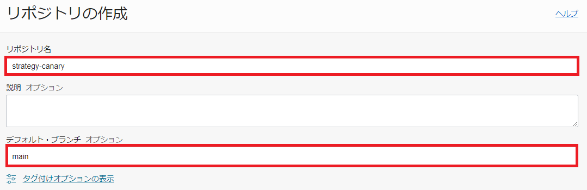


「HTTPS」ボタンをクリックして、コマンドの「コピー」テキストをクリック後、コマンドを実行してクローンします。

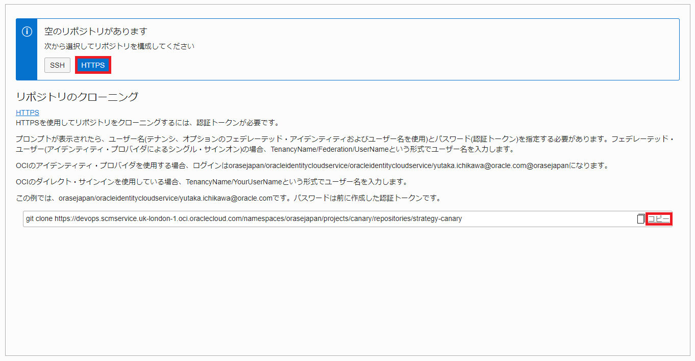

クローンしたディレクトリにサンプルコードをコピーします。

```
cp -pR devops-deploy-strategy/deploy-strategy-canary/* ./strategy-canary/
```
```
ls strategy-canary/
```
```
build_spec.yaml  canary-app.yaml  content.html  Dockerfile  ingress-controller.yaml
```

作成したリポジトリにサンプルコードをプッシュします。

```
cd strategy-canary
```
```
git add -A .
```
```
git commit -m "first commit"
```
```
[main f70c893] first commit
 5 files changed, 787 insertions(+)
 create mode 100644 Dockerfile
 create mode 100644 build_spec.yaml
 create mode 100644 canary-app.yaml
 create mode 100644 content.html
 create mode 100644 ingress-controller.yaml
```

```
git branch -M main
```
```
git push -u origin main
```
```
Enumerating objects: 8, done.
Counting objects: 100% (8/8), done.
Delta compression using up to 2 threads
Compressing objects: 100% (7/7), done.
Writing objects: 100% (7/7), 3.82 KiB | 3.82 MiB/s, done.
Total 7 (delta 0), reused 0 (delta 0), pack-reused 0
To https://devops.scmservice.uk-london-1.oci.oraclecloud.com/namespaces/orasejapan/projects/canary/repositories/strategy-canary
   0a0612a..f70c893  main -> main
Branch 'main' set up to track remote branch 'main' from 'origin'.
```

リポジトリを確認すると、サンプルコードが表示されています。

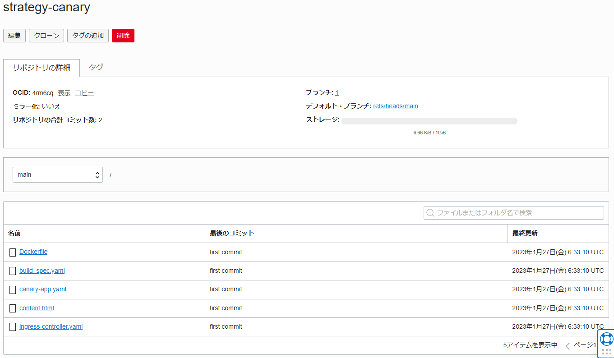

#### 4. アーティファクト 作成

Kubernetesクラスタにデプロイする際に必要となるマニフェストファイルをアーティファクトレジストリにアップロードします。最初にアーティファクトレジストリにリポジトリを作成します。

アップロードするマニフェストファイル内にある、コンテナイメージのパスを変更します。

```
cd strategy-canary
```
```
vim canary-app.yaml 
```
```
apiVersion: apps/v1
kind: Deployment
metadata:
  name: helloworld
spec:
  selector:
    matchLabels:
      app: helloworld
  replicas: 3
  template:
    metadata:
      labels:
        app: helloworld
    spec:
      containers:
        - name: helloworld
          # enter the path to your image, be sure to include the correct region prefix
          image: lhr.ocir.io/orasejapan/canary/canary-app:${BUILDRUN_HASH}
          ports:
            - containerPort: 80
---
apiVersion: v1
kind: Service
metadata:
  name: helloworld
  #annotations:
   #service.beta.kubernetes.io/oci-load-balancer-shape: "100Mbps"
spec:
  type: ClusterIP
  ports:
    - port: 80
      targetPort: 80
  selector:
    app: helloworld
---
# main-ingress.yaml with networking.k8s.io/v1 version
apiVersion: networking.k8s.io/v1
kind: Ingress
metadata:
  name: helloworld-ing
  annotations:
    kubernetes.io/ingress.class: "nginx"
spec:
  rules: 
    - http:
        paths:
          - path: /
            pathType: Prefix
            backend:
              service:
                name: helloworld
                port:
                  number: 80
```

ハンバーガーメニューから「開発者サービス」-「アーティファクト・レジストリ」を選択します。


「リポジトリの作成」ボタンをクリックします。


以下の設定を行い、「作成」ボタンをクリックします。

- 名前：artifact-repository-canary
- コンパートメント：対象となるコンパートメント
- 不変アーティファクト：チェックを外す

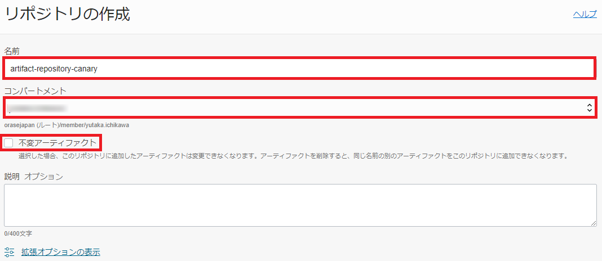


マニフェストファイルをアップロードします。「アーティファクトのアップロード」ボタンをクリックします。


以下の設定を行い、「コピー」テキストをクリックします。

- アーティファクト・パス：canary-app.yaml
- バージョン：1
- Uplad method：Cloud Shell

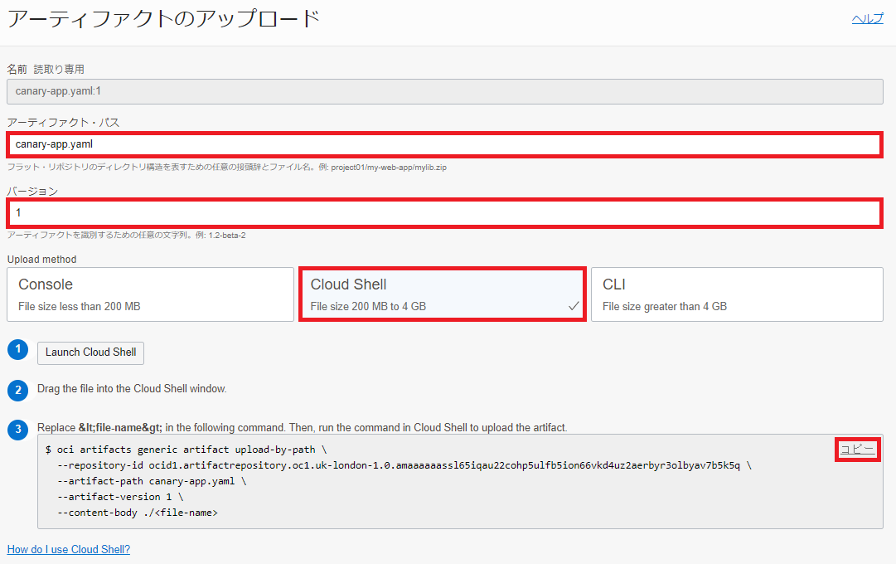

コピーした内容をペーストして、「./＜file-name＞」の箇所を「./blue-grenn-app.yaml」に変更してコマンドを実行します。

```
oci artifacts generic artifact upload-by-path \
>   --repository-id ocid1.artifactrepository.oc1.uk-london-1.0.amaaaaaassl65iqau22cohp5ulfb5ion66vkd4uz2aerbyr3olbyav7b5k5q \
>   --artifact-path canary-app.yaml \
>   --artifact-version 1 \
>   --content-body ./canary-app.yaml
```
以下の結果が返ってくればアップロード完了です。
```
{
  "data": {
    "artifact-path": "canary-app.yaml",
    "compartment-id": "ocid1.compartment.oc1..aaaaaaaagp3t6j5zjzg3hrau4i3rtcxvl64cxbcdgpid5smp6avpnfecegqa",
    "defined-tags": {},
    "display-name": "canary-app.yaml:1",
    "freeform-tags": {},
    "id": "ocid1.genericartifact.oc1.uk-london-1.0.amaaaaaassl65iqadlt552fyxu47nmxxtxl3sb22ak4pui6xrlstojc4stha",
    "lifecycle-state": "AVAILABLE",
    "repository-id": "ocid1.artifactrepository.oc1.uk-london-1.0.amaaaaaassl65iqau22cohp5ulfb5ion66vkd4uz2aerbyr3olbyav7b5k5q",
    "sha256": "d41bb6efd5988e3fbb9646963e1477863bcb567237f4dfd77cf46384b95b9e8c",
    "size-in-bytes": 1126,
    "time-created": "2023-01-27T06:50:01.017000+00:00",
    "version": "1"
  }
}
```

「閉じる」ボタンをクリックします。


ブラウザを更新するとアップロードしたアーティファクトがリストされます。

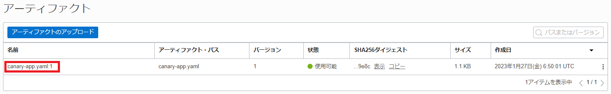

OCI DevOpsの「canary」プロジェクト画面に戻って、アーティファクトに対象のOCIRとアーティファクトレジストリのリポジトリを登録します。

OCI DevOpsの左目メニューから「アーティファクト」を選択します。


「アーティファクトの追加」ボタンをクリックします。


以下の設定を行い、「追加」ボタンをクリックします。

- 名前：ocir-repogitory-canary
- タイプ：コンテナ・イメージ・リポジトリ
- コンテナ・レジストリのイメージへの完全修飾パスを入力してください：マニフェストファイルに指定したリポジトリを設定してください

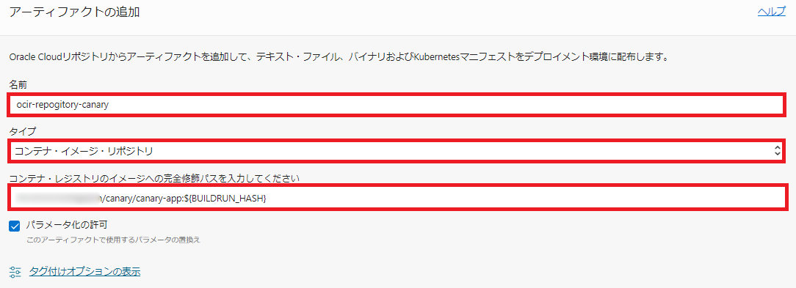


「アーティファクトの追加」ボタンをクリックします。


以下の設定を行い、「選択」ボタンをクリックします。

- 名前：artifact-repogitory-canary
- タイプ：Kubernetesマニフェスト

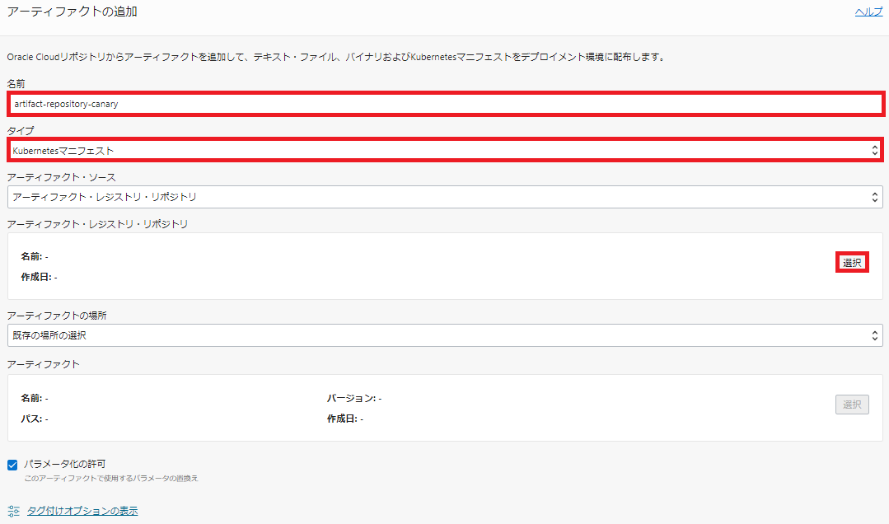

以下の設定を行い、「選択」ボタンをクリックします。

- リージョン：対象となるリージョン
- コンパートメント：対象となるコンパートメント
- アーティファクト・レジストリ・リポジトリ：artifact-repository-canary

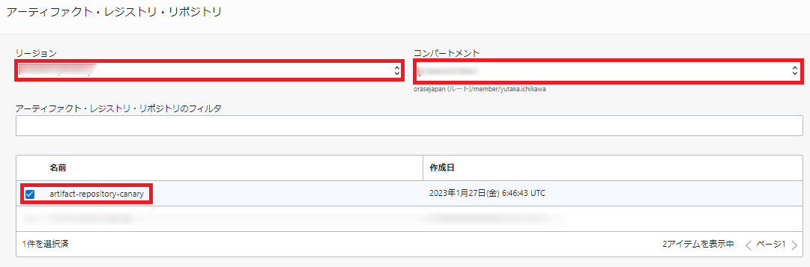


「アーティファクト」の「選択」ボタンをクリックします。


「canary-app.yaml:v1」にチェックを入れて、「選択」ボタンをクリックします。

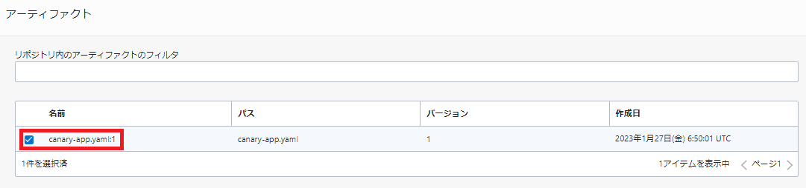


最後に「追加」ボタンをクリックします。


登録したOCIRとアーティファクト・レジストリのリポジトリがリストされていることを確認します。

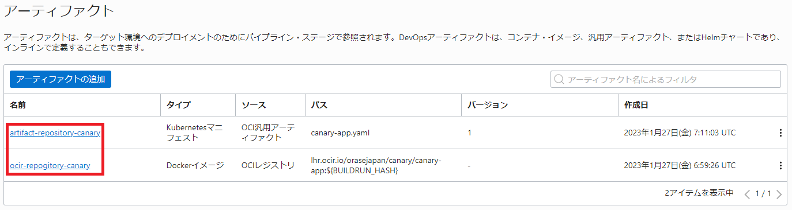

パンくずリストから「canary」を選択します。

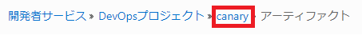

#### 5. デプロイメント・パイプライン 作成

デプロイメント・パイプラインを作成します。  
左メニューから「デプロイメント・パイプライン」を選択します。


「パイプラインの作成」ボタンをクリックします。


以下の設定を行い、「パイプラインの作成」ボタンをクリックします。

- パイプライン名：deploy-to-oke


「ステージの追加」ボタンをクリックします。


「カナリア戦略」を選択して、「次」ボタンをクリックします。

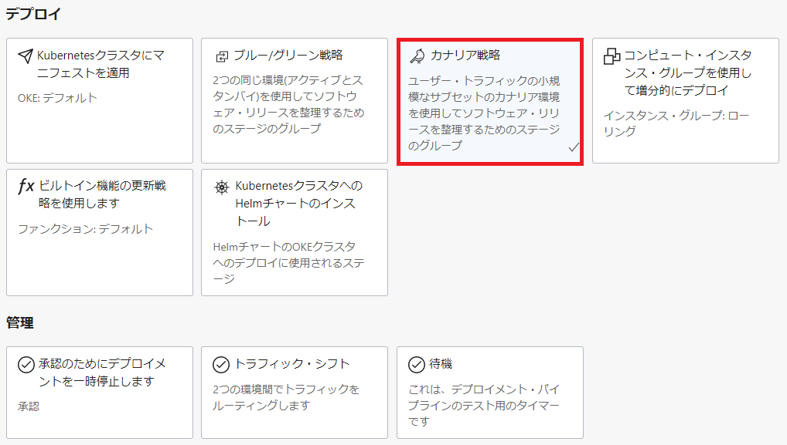


以下の設定を行い、「アーティファクトの選択」ボタンをクリックします。

- デプロイメント・タイプ：OKE
- ステージ名：deploy-strategy-canary
- 環境：canary-cluster
- カナリア・ネームスペース：canary
- NGINXイングレス名：helloworld-ing

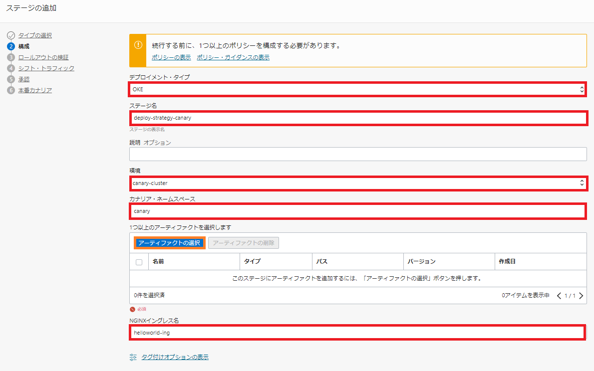

「artifact-repository-canary」を選択して、「変更の保存」ボタンをクリックします。

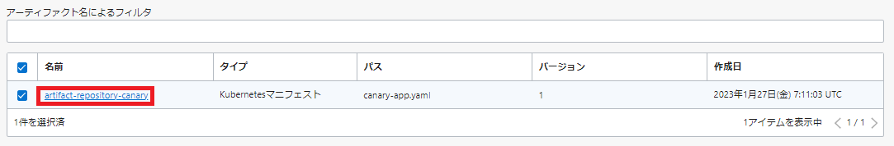


「次」ボタンをクリックします。


検証制御は、「なし」のままにして、「次」ボタンをクリックします。


以下の設定を行い、「次」ボタンをクリックします。

- ステージ名：canary
- ランプアップ制限%：25

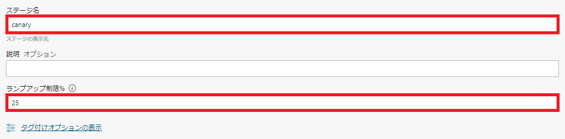


以下の設定を行い、「次」ボタンをクリックします。

- ステージ名：confirm

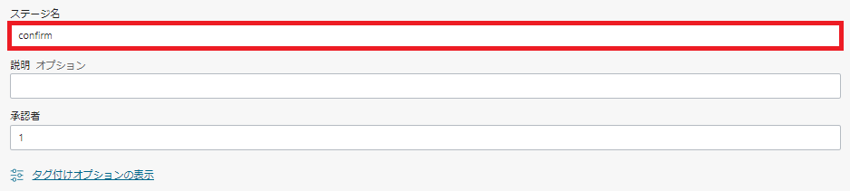


以下の設定を行い、「追加」ボタンをクリックします。

- ステージ名：deploy
- 本番ネームスペース：default

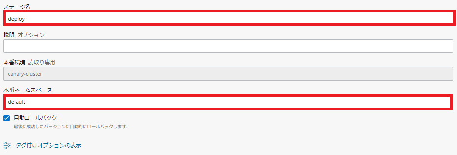


完了と表示されることを確認して、「閉じる」ボタンをクリックします。

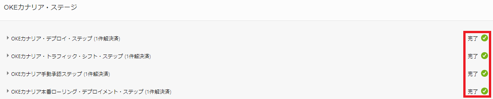


パンくずリストから「canary」を選択します。


#### 6. ビルド・パイプライン 作成

ビルド・パイプラインを作成します。  
左メニューから「ビルド・パイプライン」を選択します。


「ビルド・パイプラインの作成」ボタンをクリックします。


以下の設定を行い、「作成」ボタンをクリックします。

- 名前：image-build-ship


「ステージの追加」ボタンをクリックします。


「マネージド・ビルド」を選択して、「次」ボタンをクリックします。


以下の設定を行い、「選択」ボタンをクリックします。

- ステージ名：container-image-build
- ビルド仕様ファイル・パス：build_spec.yaml


以下の設定を行い、「選択」ボタンをクリックします。

- ソース：接続タイプ：OCIコード・リポジトリ
- strategy-canary にチェックを入れる
- ブランチの選択：main

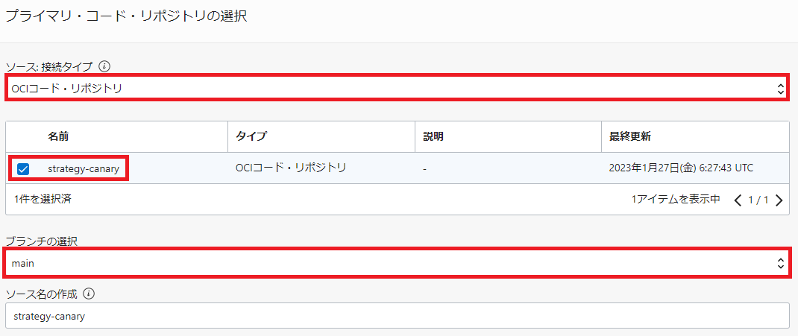


「追加」ボタンをクリックします。


「+」をクリックして、「ステージの追加」を選択します。


「アーティファクトの配信」を選択して、「次」ボタンをクリックします。


以下の設定を行い、「アーティファクトの選択」ボタンをクリックします。

- ステージ名：container-image-ship


「ocir-repository-canary」にチェックを入れて、「追加」ボタンをクリックします。

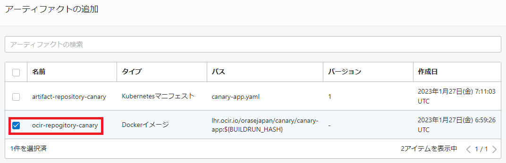


「ビルド構成/結果アーティファクト名」に「canary_image」と設定を行い、「追加」ボタンをクリックします。

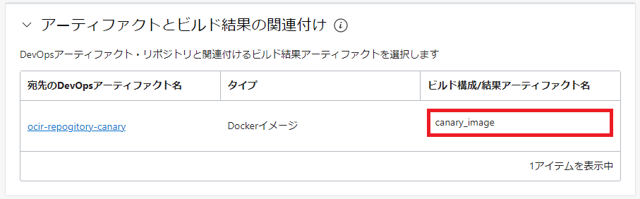


「+」をクリックして、「ステージの追加」を選択します。


「デプロイメントのトリガー」を選択して、「次」ボタンをクリックします。


以下の設定を行い、「デプロイメント・パイプラインの選択」ボタンをクリックします。

- ステージ名：connect-to-deployment-pipeline


「deploy-to-oke」にチェックを入れて、「変更の保存」ボタンをクリックします。


最後に「追加」ボタンをクリックします。


パンくずリストから「canary」を選択します。

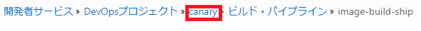

#### 7. トリガー 作成

ソースコード更新後のプッシュをトリガーにCanaryを実行する設定を行います。  
左メニューから「トリガー」を選択します。


「トリガーの作成」ボタンをクリックします。


以下の設定を行い、「選択」ボタンをクリックします。

- 名前：deploy-strategy-canary
- ソース接続：OCIコード・リポジトリ

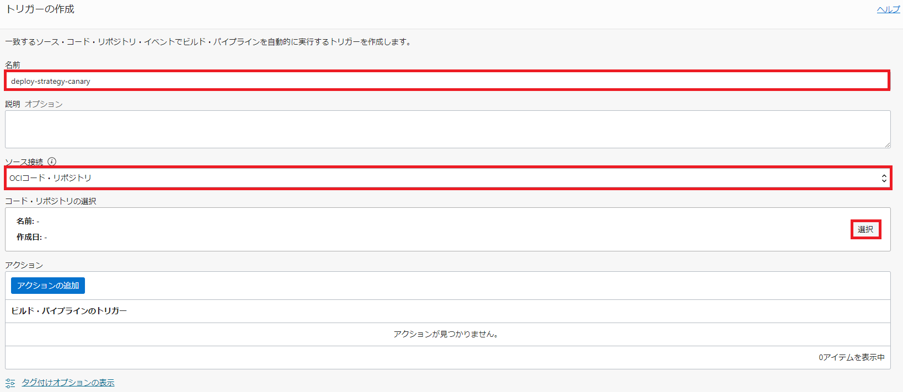

「strategy-canary」にチェックを入れて、「変更の保存」ボタンをクリックします。


「アクションの追加」ボタンをクリックします。


「プッシュ」にチェックを入れて、「選択」ボタンをクリックします。


「image-build-ship」にチェックを入れて、「選択」ボタンをクリックします。


「アクションの追加」ボタンをクリックします。


最後に、「作成」ボタンをクリックします。


以上で完了です。

### カナリア 実行

ソースコードを変更して、first バジョンとしてデプロイします。

```
cd strategy-canary
```

表示されるテキストの「Hello, Canary deploy !!」を「Hello, Canary first!!」に変更します。

```
vim content.html
```
```
<!DOCTYPE html>
<html lang="ja">
<head>

<meta charset="UTF-8">

<title>Blue-Green</title>

</head>
<body>

<h1>Hello, Canary deploy !!</h1> #「Canary deploy first!!」に変更

</body>
</html>
```

コード・リポジトリにプッシュします。

```
git add -A .
```
```
git commit -m "second commit"
```
```
[main 1e304fc] second commit
 2 files changed, 2 insertions(+), 2 deletions(-)
```
```
git branch -M main
```
```
git push -u origin main
```
```
Enumerating objects: 7, done.
Counting objects: 100% (7/7), done.
Delta compression using up to 2 threads
Compressing objects: 100% (4/4), done.
Writing objects: 100% (4/4), 496 bytes | 496.00 KiB/s, done.
Total 4 (delta 2), reused 0 (delta 0), pack-reused 0
remote: Resolving deltas: 100% (2/2)
To https://devops.scmservice.uk-london-1.oci.oraclecloud.com/namespaces/orasejapan/projects/canary/repositories/strategy-canary
   f70c893..1e304fc  main -> main
Branch 'main' set up to track remote branch 'main' from 'origin'.
```

デプロイメント・パイプラインの承認処理を手動で実行します。  
「confirm」のハンバーガーメニューから「承認」を選択します。

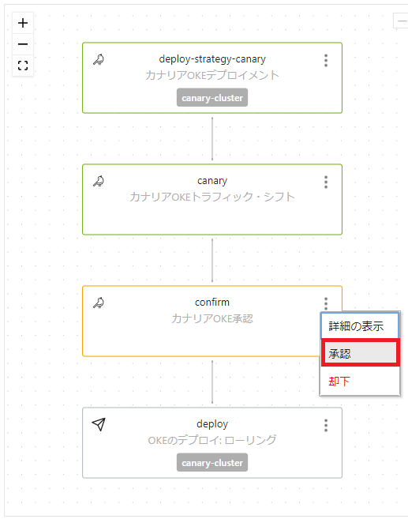

「OK」と入力して、「承認」ボタンをクリックします。

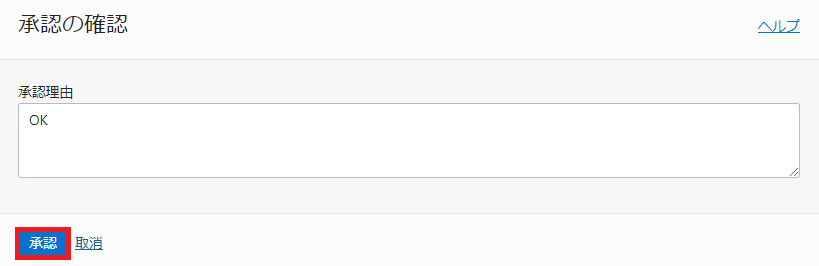

デプロイメント・パイプラインが成功したことを確認します。

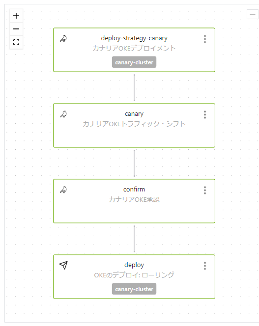

ブラウザからアクセスるために、EXTERNAL-IPを確認します。

```
kubectl get ingress
```
```
NAME             CLASS    HOSTS   ADDRESS           PORTS   AGE
helloworld-ing   <none>   *       193.xxx.xxx.xxx   80      10m
```

ブラウザを起動してアクセスします。

```
http://193.xxx.xxx.xxx/content.html
```

以下表示されることを確認します。


second バージョンとしてデプロイを実行しながらカナリアを確認します。

表示されるテキストの「Hello, Canary deploy first!!」を「Hello, Canary second!!」に変更します。

```
vim content.html
```
```
<!DOCTYPE html>
<html lang="ja">
<head>

<meta charset="UTF-8">

<title>Blue-Green</title>

</head>
<body>

<h1>Hello, Canary deploy first!!</h1> #「Canary deploy second!!」に変更

</body>
</html>
```

コード・リポジトリにプッシュします。

```
git add -A .
```
```
git commit -m "third commit"
```
```
[main dbeed1d] third commit
 1 file changed, 1 insertion(+), 1 deletion(-)
```
```
git branch -M main
```
```
git push -u origin main
```
```
Enumerating objects: 5, done.
Counting objects: 100% (5/5), done.
Delta compression using up to 2 threads
Compressing objects: 100% (3/3), done.
Writing objects: 100% (3/3), 311 bytes | 311.00 KiB/s, done.
Total 3 (delta 2), reused 0 (delta 0), pack-reused 0
remote: Resolving deltas: 100% (2/2)
To https://devops.scmservice.uk-london-1.oci.oraclecloud.com/namespaces/orasejapan/projects/canary/repositories/strategy-canary
   1305812..dbeed1d  main -> main
Branch 'main' set up to track remote branch 'main' from 'origin'.
```

デプロイメント・パイプラインの承認処理前に、default namespaceにデプロイされている「Hello, Canary deploy first!!」とcanary namespaceにデプロイされている「Hello, Canary deploy second!!」の両方がブラウザで表示されることを確認します。  
canary namespaceにデプロイされている「Hello, Canary deploy second!!」は、デプロイメント・パイプライン作成時に設定した25%割合で表示されます。

承認処理待ちであることを確認します。

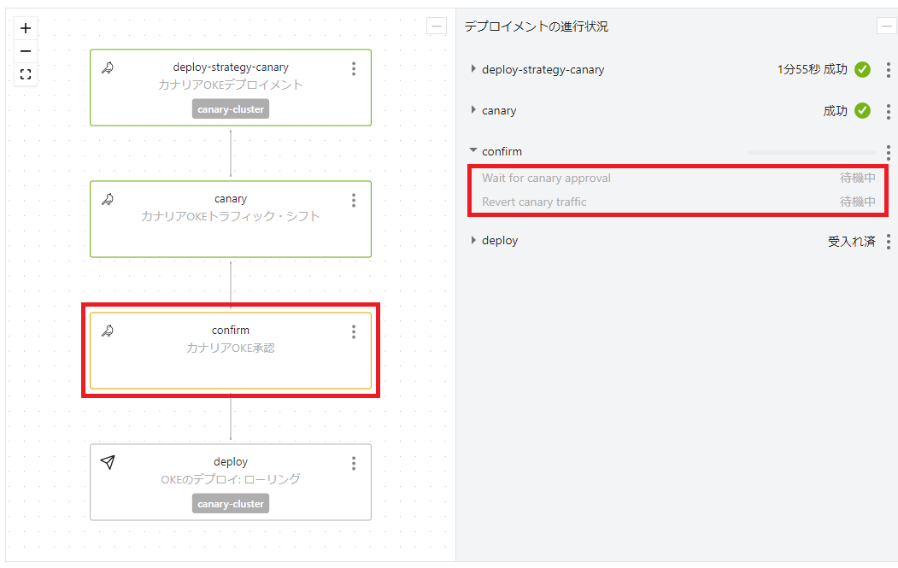

ブラウザの更新ボタンを数回押しながら、以下二つの表示が行われることを確認します。

default namespaceにデプロイされている「Hello, Canary deploy first!!」


canary namespaceにデプロイされている「Hello, Canary deploy second!!」

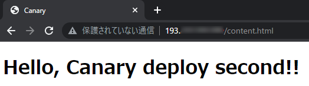

確認後、デプロイメント・パイプラインの承認処理を手動で実行します。  
「confirm」のハンバーガーメニューから「承認」を選択します。


「OK」と入力して、「承認」ボタンをクリックします。


デプロイメント・パイプラインが成功したことを確認します。


再度、ブラウザからアクセスます。何度更新ボタンを押しても「Hello, Canary deploy second!!」と表示されることを確認します。


承認処理前では、25%の割合でcanary namespaceにトラフィックシフトされていましたが、承認処理後はdefault namespace上のアプリケーションが更新されて、100%の割合で「Hello, Canary deploy second!!」と表示されます。

承認処理待ちの間、canary namespaceのIngressは、「canary-weight: "25"」となっています。

```
kubectl get ingress -o yaml -n canary
```
```
apiVersion: v1
items:
- apiVersion: networking.k8s.io/v1
  kind: Ingress
  metadata:
    annotations:
      kubernetes.io/ingress.class: nginx
      nginx.ingress.kubernetes.io/canary: "true"
      nginx.ingress.kubernetes.io/canary-by-header: redirect-to-canary
      nginx.ingress.kubernetes.io/canary-weight: "25"
・
・＜省略＞
・
```

承認処理後は、canary namespaceのIngressは、「canary-weight: "0"」となります。

```
kubectl get ingress -o yaml -n canary
```
```
apiVersion: v1
items:
- apiVersion: networking.k8s.io/v1
  kind: Ingress
  metadata:
    annotations:
      kubernetes.io/ingress.class: nginx
      nginx.ingress.kubernetes.io/canary: "true"
      nginx.ingress.kubernetes.io/canary-by-header: redirect-to-canary
      nginx.ingress.kubernetes.io/canary-weight: "0"
・
・＜省略＞
・
```